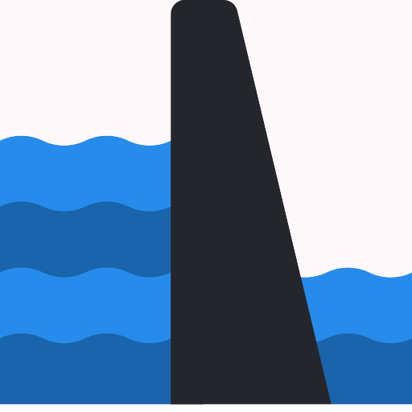
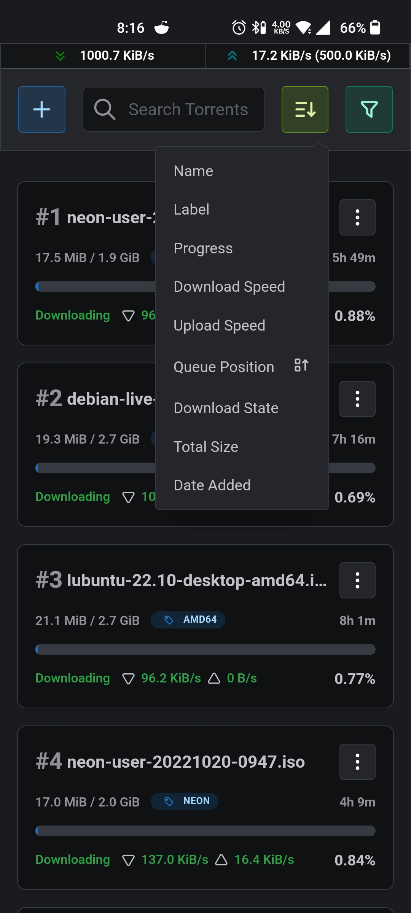

<h1 align="center">Barrage</h1></br>
<p align="middle"></p>


> Introducing Barrage
>
> Minimal Deluge WebUI with full mobile support


&nbsp;


## Features

* Responsive mobile first design
* Add torrent by URL or magnet
* Sort and Filter Torrents
* Global upload and Download speed limits
* Change File Priority
* Change Torrent options

## Screenshots

<details>
  <summary>Click me</summary>
  &nbsp;
<p align="center">

  &nbsp;  &nbsp;  

  &nbsp;  &nbsp;  

  &nbsp;  &nbsp;  

  &nbsp;  &nbsp;  

  &nbsp;  &nbsp;  

  &nbsp;  &nbsp;  

  &nbsp;  &nbsp;  

  &nbsp;  &nbsp;  

  &nbsp;  &nbsp;  

  &nbsp;  &nbsp;  

</p>

</details>


## Deploy

You can deploy barrage with docker.

```
docker run --name barrage \
  -p 3000:3000 \
  -e NEXTAUTH_SECRET=secret \
  -e DELUGE_URL=http://localhost:8112 \
  -e DELUGE_PASSWORD=password \
  -e BARRAGE_PASSWORD=password \
  maulik9898/barrage

```

Then you can use the following environment variables to configure Barrage

| Environment | Description |
| ----------- | ----------- |
| `NEXTAUTH_SECRET` | Used to encrypt the NextAuth.js JWT |
| `DELUGE_URL` | The Deluge WebUI URL |
| `DELUGE_PASSWORD` | The password from deluge WebUI |
| `BARRAGE_PASSWORD` | The password for accessing Barrage |


You can quickly create a good value of NEXTAUTH_SECRET on the command line via this openssl command.

```
openssl rand -base64 32
```

### Deploy on vercel

[](https://vercel.com/new/clone?repository-url=https%3A%2F%2Fgithub.com%2Fmaulik9898%2Fbarrage&env=BARRAGE_PASSWORD,NEXTAUTH_SECRET,DELUGE_URL,DELUGE_PASSWORD&project-name=barrage)

## Acknowledgments

Thanks to [@scttcper](https://github.com/scttcper) for [Deluge api wrapper](https://github.com/scttcper/deluge).
